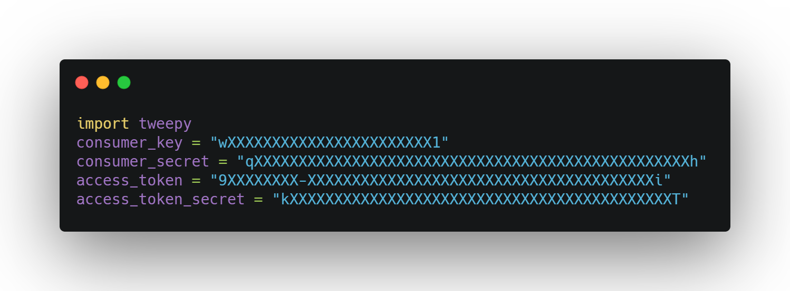
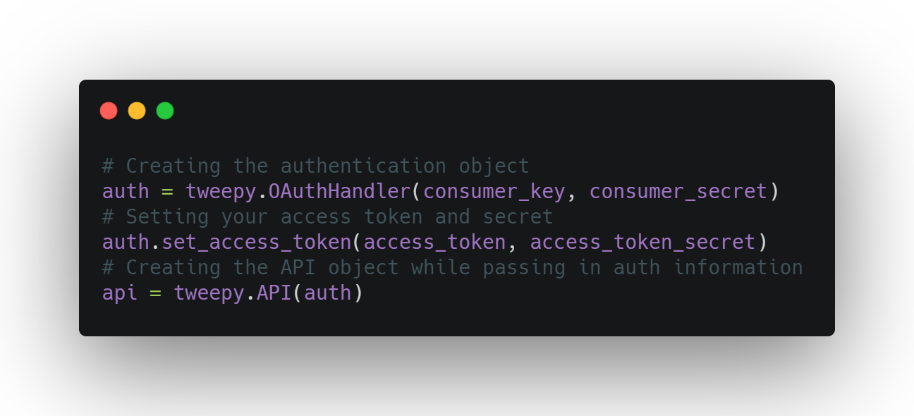
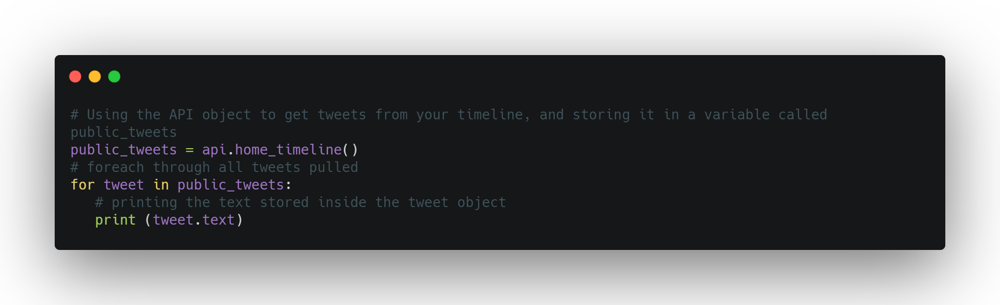
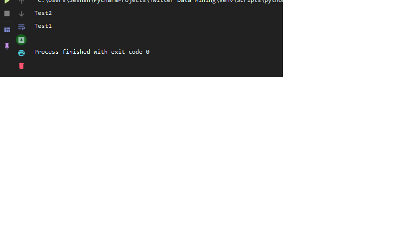
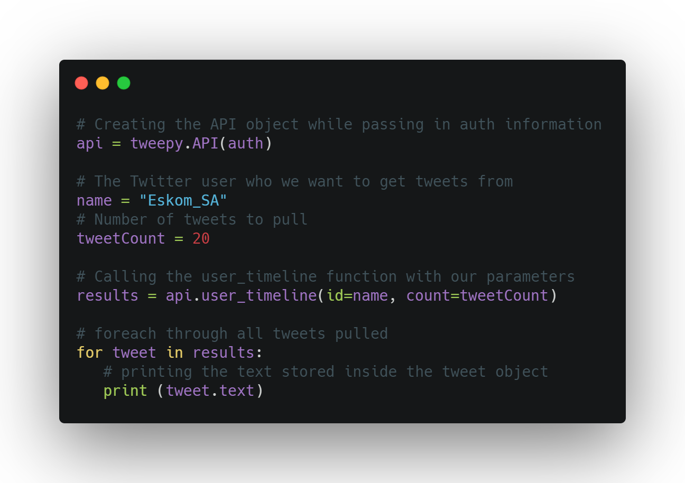
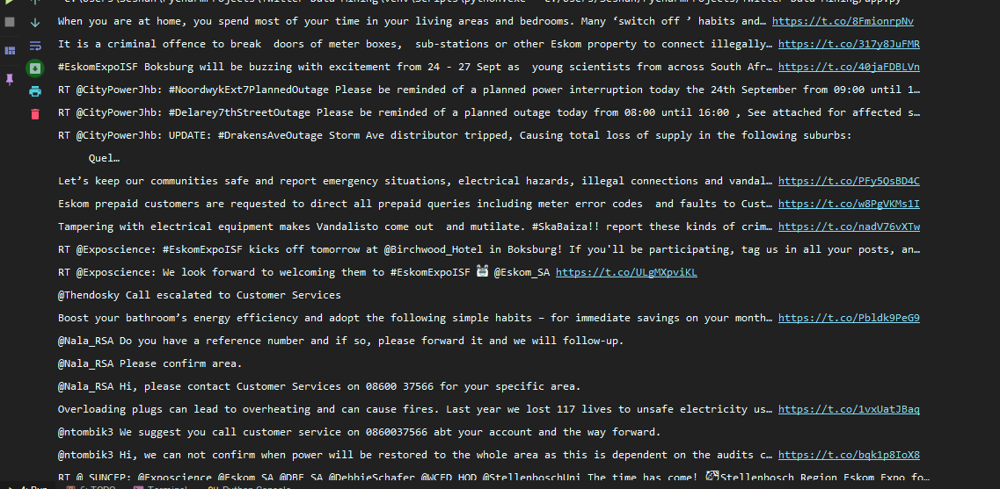
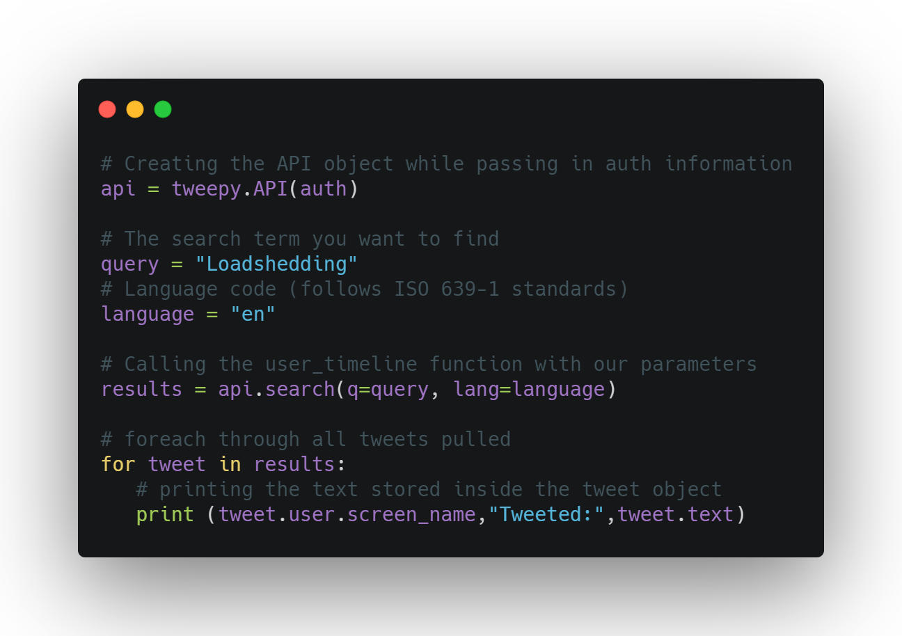
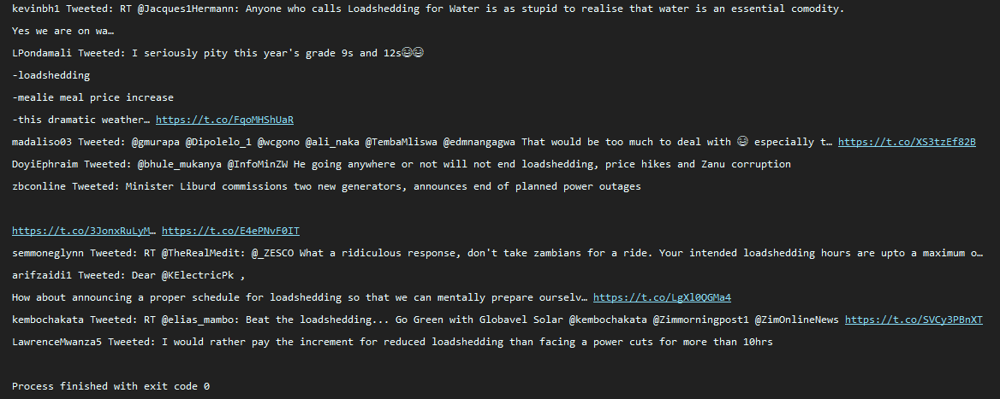

# twitter-data-mining
Hi Eskom :)

# Why Twitter data?

Twitter is a gold mine of data. Unlike other social platforms, almost every user’s tweets are completely public and pullable. This is a huge plus if you’re trying to get a large amount of data to run analytics on. Twitter data is also pretty specific. Twitter’s API allows you to do complex queries like pulling every tweet about a certain topic within the last twenty minutes, or pull a certain user’s non-retweeted tweets.

A simple application of this could be analyzing how your company is received in the general public. You could collect the last 2,000 tweets that mention your company (or any term you like), and run a sentiment analysis algorithm over it.

We can also target users that specifically live in a certain location, which is known as spatial data. Another application of this could be to map the areas on the globe where your company has been mentioned the most.

As you can see, Twitter data can be a large door into the insights of the general public, and how they receive a topic. That, combined with the openness and the generous rate limiting of Twitter’s API, can produce powerful results.

## Tools:
- PyCharm (you can download the community edition https://www.jetbrains.com/pycharm/)
- A python library called Tweepy

## Getting started:

1. You're going to have to create a twitter developer account, this won't take that long, https://developer.twitter.com/
2. Once that's done, click "Create new application" and fill out the required info.
3. Once the application has been created, click the “Keys and Access Tokens” tab to get your consumer secret and consumer key, you will also need a pair of access tokens, scroll down and click the button "Generate tokens" and you should now have an access token and access token secret.  We’ll need all of that later, so make sure you keep that tab open.

4. #### Installing Tweepy
Easiest way to install Tweepy is to type ```pip install tweepy``` , alternatively you can follow the instructions on their github page https://github.com/tweepy/tweepy

## Coding time 🦄:

The baseline of each application we’ll build today requires using Tweepy to create an API object which we can call functions with. In order create the API object, however, we must first authenticate ourselves with our developer information.

First we need to import tweepy and our own authentication information:


Now we create our API object:

This will be the basis of every application we build, so make sure you don’t delete it.

### Exercises:

1. #### Your Timeline:
- We’ll be pulling the ten most recent tweets from your Twitter feed. We’ll do this by using the API object’s home_timeline() function. We can then store the result in a variable, and loop through it to print the results.



And the result should include your latest tweets, in my case it was a new account:



##### JSON:
In the example above, we printed the text from each tweet using tweet.text. To refer to specific attributes of each tweet object, we have to look at the JSON returned by the Twitter API.

The result you receive from the Twitter API is in a JSON format, and has quite an amount of information attached. For simplicity, we focused on the “text” attribute of each tweet.  For more documentation on the other attributes being returned in the JSON, please refer to https://developer.twitter.com/en/docs/tweets/curate-a-collection/api-reference/get-collections-entries

2. #### Tweets from a specific user:
In this example, we’ll simply pull the latest twenty tweets from a user of our choice.  In this case, Eskom 😊



Result should be similar to :



3. #### Finding Tweets using a keyword:
Getting the most recent tweets that contain a keyword. This can be extremely useful if you want to monitor specifically mentioned topics in the Twitter world, or even to see how your business is getting mentioned.



Results should match to your query:



Twitter’s API is immensely useful in data mining applications, and can provide vast insights into the public opinion. If the Twitter API and big data analytics is something you have further interest in, I encourage you to read more about the Twitter API, Tweepy, and Twitter’s Rate Limiting guidelines.
