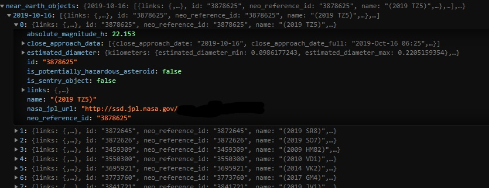

# Playing around with the NASA API


### Ensure you sign up and generate an API key here: https://api.nasa.gov/index.html#signUp

Example using the API to bring back data on near earth objects between a certain time period:
```
fetch(
  "https://api.nasa.gov/neo/rest/v1/feed?start_date=2019-10-16&end_date=2019-10-23&api_key=ENTER_YOUR_API_KEY_HERE"
)
  .then(function(response) {
    console.log(response);
  })
  .catch(function(response) {
    console.log("Error! Please try again");
  });

```

## Near earth  object data from NASA:
